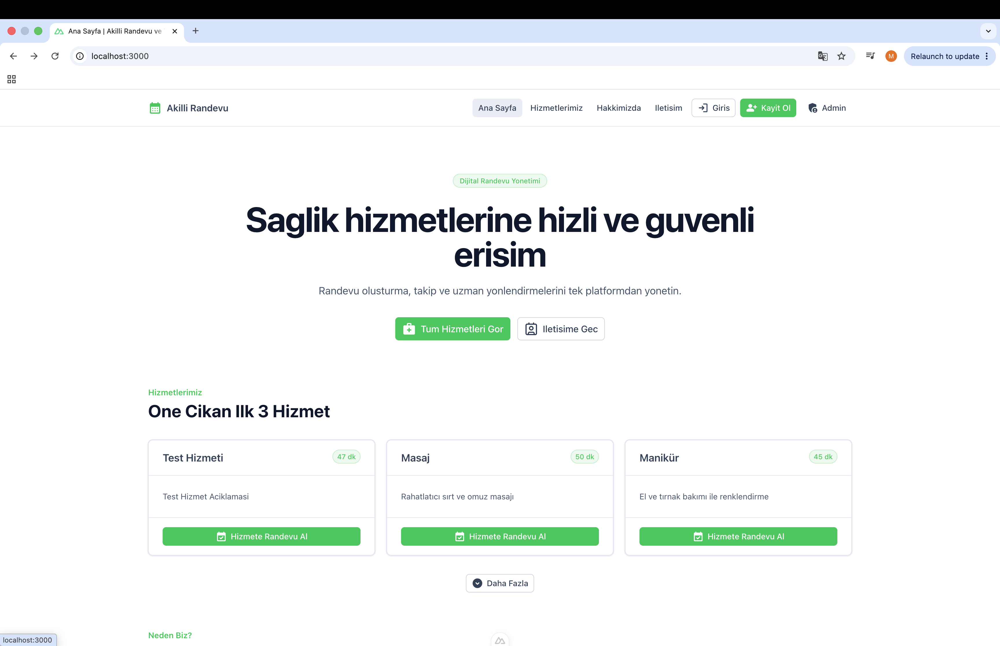
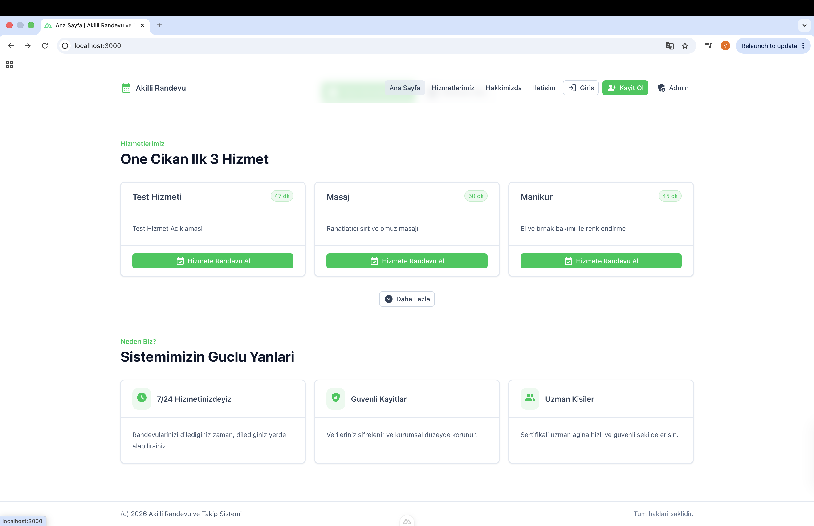
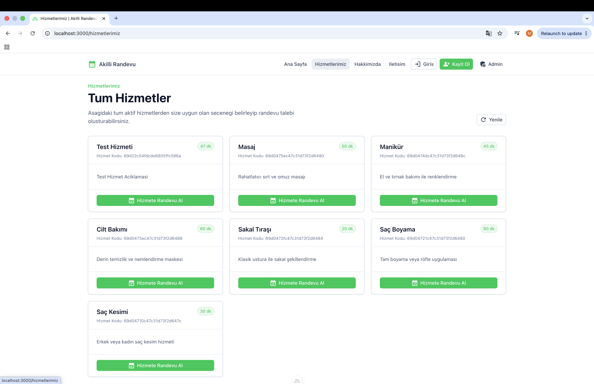
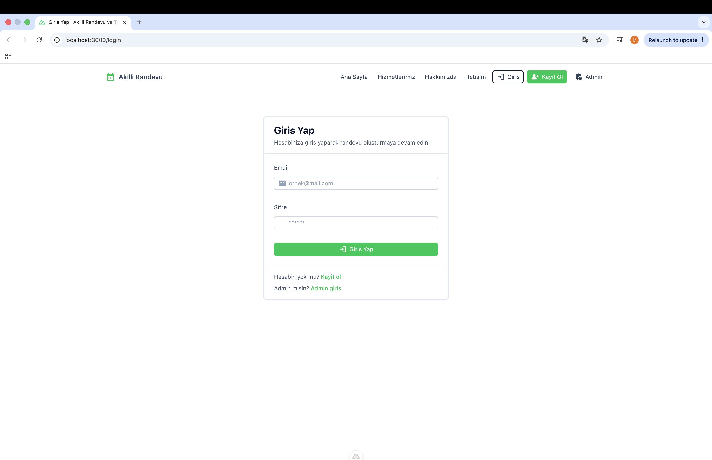
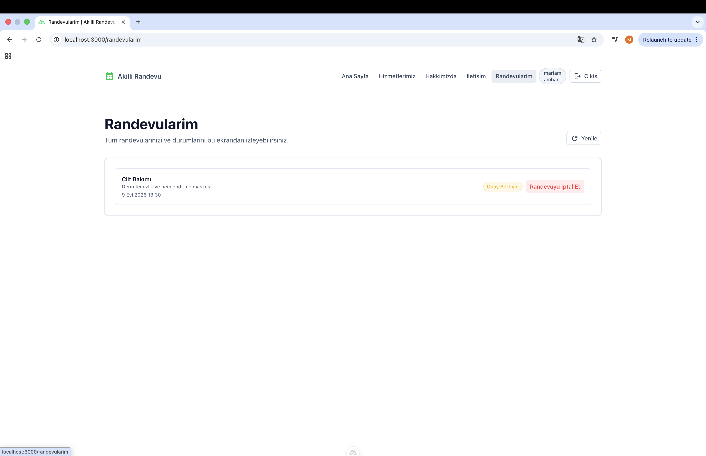

# Appointment Tracking System

A full-stack appointment and service tracking system built with Nuxt.js, Node.js, Express, MongoDB, and JWT Authentication.

## Features

- User Registration & Login 
- JWT Authentication
- Appointment Management
- Service Management
- Admin Dashboard
- User Dashboard
- Protected Routes
- Responsive UI

## Screenshots

### Home



### Services


### Login


### My Appointments



## Technologies Used

### Frontend
- Nuxt.js
- Vue.js
- TypeScript

### Backend
- Node.js
- Express.js
- MongoDB
- JWT Authentication

## Project Structure

```text
appointment-tracking-system
├── frontend
└── backend
```

## Installation

### Backend

```bash
cd backend
npm install
npm start
```

### Frontend

```bash
cd frontend
npm install
npm run dev
```

## Environment Variables

Create a `.env` file inside the backend folder and configure:

```env
MONGO_URI=your_mongodb_connection
JWT_SECRET=your_secret_key
PORT=8080
```

## Author

Mariam Amhan 
